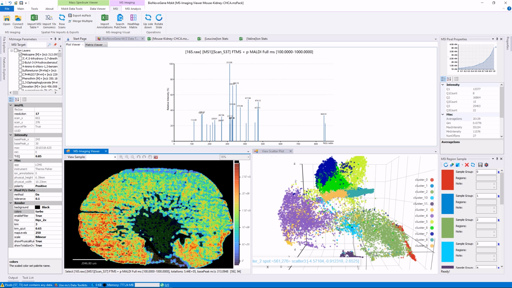
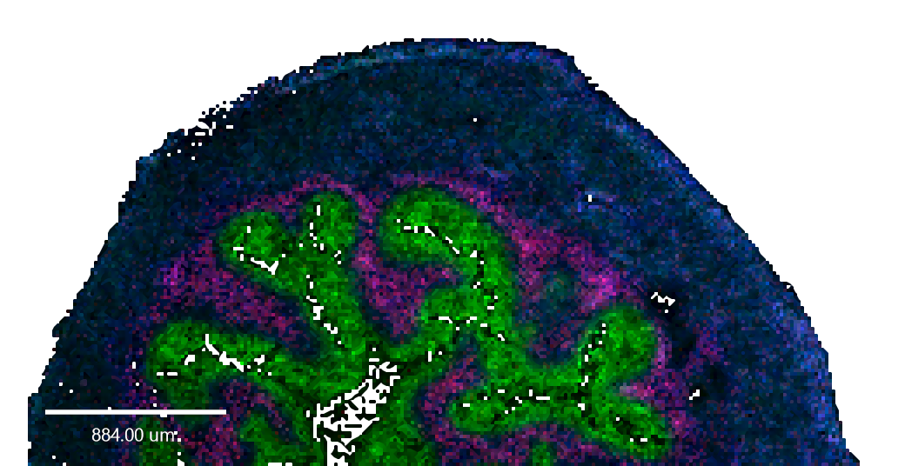

# mzkit_win32

Mzkit Windows Desktop Application, this source repository is a submodule of the mzkit project: https://github.com/xieguigang/mzkit

## Source development &amp; compile 

1. Git clone of source projects and all of the submodules inside the repository:
   + [MZKit](https://github.com/xieguigang/mzkit.git)
   + [GCModeller](https://github.com/SMRUCC/GCModeller.git)

2. Development of MZKit in VisualStudio:
   + open the visual studio solution file in mzkit source folder: "src/mzkit/mzkit_win32.sln"

3. Build R language environment in VisualStudio:
   + open the visual studio solution file in GCModeller source folder: "src/R-sharp/R_system.NET5.sln"
   
4. Build R environment:
   + run the batch file in mzkit source folder: "src/mzkit/setup/build_pkgs.cmd" 
   
5. Finally build the installer package project:
   + open the project file in ``Advanced Installer`` in mzkit source folder: "src/mzkit/setup/mzkit_setups.aip"

> demo ms-imaging generated from MZKit, raw data reference:
>
> https://www.ebi.ac.uk/pride/archive/projects/PXD001283
>
> DOI: 10.1002/anie.200905559, PubMed: 20397170, Des: Römpp A, Guenther S, Schober Y, Schulz O, Takats Z, Kummer W, Spengler B; Histology by mass spectrometry: label-free tissue characterization obtained from high-accuracy bioanalytical imaging., Angew Chem Int Ed Engl, 2010 May 17, 49, 22, 3834-8,

## Reference

1. SMILES drawer: https://github.com/reymond-group/smilesDrawer, J. Chem. Inf. Model. 2018, 58, 1, 1–7 
   Publication Date:December 19, 2017
   https://doi.org/10.1021/acs.jcim.7b00425

2. Chemical structure drawer: https://github.com/epam/ketcher 